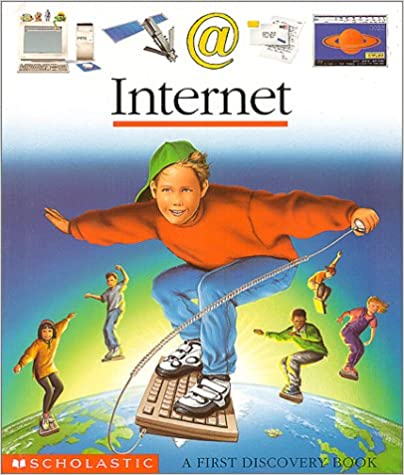

<section markdown="block" class="intro-slide">
# {{ page.title }}

### {{ site.vars.course_number}} {{ site.vars.course_name }}

<small></small>

</section>

<section markdown="block">
## Topics

__In this set of slides, we'll cover:__ &rarr;

* {:.fragment} The Internet vs the Web
* {:.fragment} Client - Server
* {:.fragment} Resources on the Web: HTML, CSS, JavaScript, Images
* {:.fragment} __Demo__: networking tab, view source
* {:.fragment} Why it's hard to save a web page for offline viewing

__Resources__
{:.fragment}

* {:.fragment} [Mozilla Developer Network - Getting started with the Web](https://developer.mozilla.org/en-US/docs/Learn/Getting_started_with_the_web)
</section>

<section markdown="block">

## What's the difference between the internet and the web? &rarr;
{:.question}

</section>

<section markdown="block">
##  The Internet

__A global system of interconnected computer networks__ &rarr;

* {:.fragment} a _network of networks_	
* {:.fragment} __TCP/IP__ - protocol that dictates how data is: 
	* {:.fragment} addressed
	* {:.fragment} _packetized_
	* {:.fragment} transmitted
	* {:.fragment} routed 
	* {:.fragment} received 
* {:.fragment} (we'll talk about protocols in a bit)

</section>

<section markdown="block">
## The World Wide Web
	
__A collection of resources...__ &rarr;

* {:.fragment} such as HTML documents, images, etc.
* {:.fragment} each retrievable by an identifier (URL)
* {:.fragment} linked together via _hypertext_ and _hyperlinks_ 
* {:.fragment} __HTTP__ is the protocol used by the web to specify
	* {:.fragment} how resources should be requested over a network
	* {:.fragment} how a request should be responded to

</section>

<section markdown="block">
## Other Services

__The web__ is just one of many services available on the internet... __what are some others services and protocols on the internet?__ &rarr;

* {:.fragment} __email__ (SMTP) ✉️
* {:.fragment} __chat__ (XMPP, OSCAR, IRC) 🗣️
* {:.fragment} __file transfer__ (FTP) ↕️
* {:.fragment} __voice__ (SIP, Skype protocol) ☎️
* {:.fragment} these are all examples of __network protocols__ -  ways of communicating over a network
</section>

<section markdown="block">
## Protocols

Hm. All this talk about protocols but ... __what _exactly_ is a protocol?__ &rarr;

It's a bunch of rules and conventions for some activity (like communication ☎️)
{:.fragment}

For communication between __computers__ 💻⬅️➡️💻  these rules may  govern:
{:.fragment}

1. the format for exchanging messages 
2. a meaning (semantics) and syntax for these messages
3. the process involved in the communication 
	* synchronization
	* delivery
	* etc.
{:.fragment}
</section>

<section markdown="block">
## TCP/IP 

__TCP/IP the Underlying Protocol of the Internet__

* {:.fragment} Other protocols, such as HTTP for the web, are built _on top_ of TCP/IP
* {:.fragment} We'll be skipping the details on TCP/IP
	* {:.fragment} If you're interested in how things work on a lower level, consider these resources:
	* {:.fragment} [A Zine About Computer Networking](https://wizardzines.com/zines/networking/)
	* {:.fragment} [How Does the Internet Work](https://web.stanford.edu/class/msande91si/www-spr04/readings/week1/InternetWhitepaper.htm) 
</section>

<section markdown="block">
## The Web

__What was our definition of the web again?__ &rarr;

A collection of interconnected documents (web pages) and other resources (images), retrievable by url and connected by _hyperlinks_.
{:.fragment}

</section>

<section markdown="block">
## It All Starts With a URL

Each document or resource on the web is retrievable by a name, a __URL__ (Uniform Resource Locator). __What are the parts to a URL?__ &rarr;

* {:.fragment} __scheme/protocol__ - http (er, browsers accept schema-less)
* {:.fragment} __domain or actual ip address__ - pizzaforyou.com
* {:.fragment} __port__ (optional) - 80 (default if http)
* {:.fragment} __path__ - /search
* {:.fragment} __query_string__ (optional) - ?type=vegan
* {:.fragment} __fragment_id__ (optional) - #topresult

 
<code>scheme://domain:port/path?query_string#fragment_id</code>
{:.fragment}

<code>http://pizzaforyou.com:80/search?type=vegan#top_result</code>
{:.fragment}
</section>

<section markdown="block">
## HTTP

To retrieve documents on the web, we use __HTTP__ (Hyper Text Transfer Protocol).

__HTTP is a very basic request-response protocol for communication between two computers:__
{:.fragment}

* {:.fragment} one computer, __the client__, asks for a resource
* {:.fragment} another computer, __the server__, sends back the requested resource
* {:.fragment} HTTP defines the format and meaning of these messages, the __request__ and __response__

</section>

<section markdown="block">
## Client - Server

The computer/application __asking for a resource__ is the __client__ or _user-agent_. __What are some examples of web clients?__  &rarr;

* {:.fragment} any browser! Firefox, Chrome, Safari, Edge, etc.

The computer __responding to these requests for resources__ is the __server__.
{:.fragment}

* {:.fragment} a __web server__ is software that specializes in... 
* {:.fragment} accepting requests from clients
* {:.fragment} and sending back a response
* {:.fragment} typically, a web server is set up such that files (such as HTML, CSS, and images) from specific directories are able to be requested 
* {:.fragment} (or it may dynamically generate HTML based on data from a database)

</section>

<section markdown="block">
## HTTP Continued

__The interaction between your browser and a web server proceeds as follows__ &rarr;

1. {:.fragment} the browser attempts to connect to the server
2. {:.fragment} if the server is listening and _reachable_, a connection is made between the server and the client
3. {:.fragment} the browser sends a request message through the connection
4. {:.fragment} on the same connection, the web server gives back a response message

⚠️ __For every resource needed by the client, a new request must be made__ 
{:.fragment}
</section>

<section markdown="block">
## A Request Message

__When a client makes a request, what, minimally should be specified in that request?__ &rarr;

__An HTTP request consists of:__ &rarr;
{:.fragment}

* the request method (what _kind_ of request you're making)
	* for example, the client can request to _read_ a resources (__GET__)
	* or it may want to update or add a resource (__POST__)
* the path to the resource 
* an optional _body_ (for example, if you're uploading a file, the file data goes here)
{:.fragment}
</section>

<section markdown="block">
## Generating Requests

__What causes your browser to send a request message to a web server?__ &rarr;

1. {:.fragment} typing in the url bar ⌨️
2. {:.fragment} clicking on a link 🖱️
3. {:.fragment} clicking submit on a form ↩️
4. {:.fragment} a page that you're already on (😮) __what, how?__
	* {:.fragment} maybe a page needs images
	* {:.fragment} ...or styles (via CSS)
	* {:.fragment} ...or interaction (via JavaScript)
</section>

<section markdown="block">
## A Response Message

__When a server responds to a request, what, minimally should be specified in the response?__ &rarr;

An HTTP Response consists of:
{:.fragment}

* {:.fragment} the actual resource (this is typically contained in the response message's body)
* {:.fragment} some _status_ (🆗, Not Found, etc.)
	* {:.fragment} in the form of both a numeric code and description
	* {:.fragment} some codes that may be familiar
	* {:.fragment} __200 OK__ - request was successful!
	* {:.fragment} __404 Not Found__ - resource was not found, but may be available again in the future
	* {:.fragment} __500 Server Error__ - generic server error

</section>

<section markdown="block">
## A Sample Request

A request... 

<pre><code data-trim contenteditable>
GET /menu/lunch HTTP/1.1
Host: mycooldomain.pizza
Connection: keep-alive
Cache-Control: max-age=0
User-Agent: Mozilla/5.0 (Macintosh; Intel Mac OS X 10_9_4) AppleWebKit/537.36 (KHTML, like Gecko) Chrome/37.0.2062.120 Safari/537.36
Accept-Language: en-US,en;q=0.8
</code></pre>
{:.fragment}
</section>

<section markdown="block">
## A Sample Response

<pre><code data-trim contenteditable>
HTTP/1.1 200 OK
Date: Thu, 18 Feb 2016 15:23:39 GMT
Server: Apache/2.2.15 (Red Hat)
Accept-Ranges: bytes
Content-Length: 163
Content-Type: text/html; charset=UTF-8
Set-Cookie: STATICSERVERID=s3; path=/
Cache-control: private

<h2>Check out this menu!</h2>
</code></pre>
{:.fragment}
</section>

<section markdown="block">
## Resources on the Web

__What are some examples of resources that a client can request from a server again?__ &rarr;

1. {:.fragment} HTML documents
2. {:.fragment} styles (CSS)
3. {:.fragment} browser based programs / interactivity (JavaScript)
4. {:.fragment} multimedia, such as: images, audio, text

</section>

<section markdown="block">
## Let's Talk HTML

__HTML__ is the language that describes the __structure__ and __semantic content__ of a document on the web; it consists of:

* {:.fragment} __content__ (just plain text)
* {:.fragment} and elements (tags) that give structure to the __text__

</section>

<section markdown="block" data-background="#440000">
## 🗣️ HTML is for content and structure!!! 
{:.question}

</section>

<section markdown="block">
## HTML is a _Mark Up_ Language

__HTML__ stands for Hypertext Markup Language. __Hypertext__ because it can link out to other documents. 

__What about the markup part?__ &rarr;

* a markup language is a method of annotating text...
	* where the markup itself is syntactically distinguishable from the content
	* markup is applied to text by using _tags_
* HTML is generally not considered a _programming_ language
* HTML documents typically in in (you guessed it!), `.html`
{:.fragment}

</section>

<section markdown="block">
## Elements,  Tags, Attributes and Content

__You've likely encountered this before__. 

An __element__ a single part of an HTML document; it encompasses both structure and (optionally) content: a paragraph, the head of the document, etc. 

<pre><code data-trim contenteditable>
&lt;a href="www.nyu.edu"&gt;NYU&lt;/a&gt;
</code></pre>
{:.fragment}

<pre><code data-trim contenteditable>
<!--             element
                    |
     +--------------+-----------+
     |                          | 
    &lt;a href="www.nyu.edu"&gt;NYU&lt;/a&gt;
     |     |                    |
     |   attribute              |
start tag                    end tag
-->
</code></pre>
{:.fragment}
</section>

<section markdown="block" data-background="#440000">
## Remember, Mark-up is for structure and meaning, not style
{:.question}
</section>

<section markdown="block">
## Such Stylish

__So, what do we use to to make our site _look good_?__ &rarr;

We use __Cascading Style Sheets__  (CSS)to style our pages:
{:.fragment}

* {:.fragment} CSS is a stylesheet language
* {:.fragment} it's used to describe the presentation and layout of an HTML document
* {:.fragment} HTML files may link to a separate CSS file for presentation
* {:.fragment} CSS file names usually have `.css` as their extension
</section>

<section markdown="block">
## Definitions 

__The following is a single CSS rule:__

<pre><code data-trim contenteditable>

selector
|   property    value 
|      |        |		    
h3 {
	font-size: 2em; ---+
	                   |---- declaration block
	color: #ff0000; ---+
	|_____________|
          |
		  declaration
}

</code></pre>
{:.fragment}

Use CSS rules to target elements in a web page and apply styles by adjusting property values.
{:.fragment}

</section>


<section markdown="block">
## Definitions

Just to get some terminology straight. __When talking about CSS.__ &rarr;

* __rule__ - the selector and all of its accompanying property:value pairs
* __selector__ - specifies an element(s) within the markup where styles will be applied
* __property__ - the name of a particular style 
* __value__ - the _actual_ style being applied on the property
* __declaration__ - the property and its value - for example: <code>color:red;</code>
* __declaration block__ - the curly braces and all of the declarations within them
	* there can be multiple __declarations__ in each __declaration block__, separated by semicolons (<code>;</code>'s)
	* (_technically_, you can leave off the semicolon of the last declaration, but that's considered bad practice -- potentially leads to errors when you add another declaration)

</section>



<section markdown="block">
## A Missing Ingredient

__Content and style are major parts of a web page, but there's a key component missing__ &rarr;

Interaction! For example:
{:.fragment}

* {:.fragment} __clicking on a button__ to trigger an animation
* {:.fragment} __scrolling__ may cause new search results to appear
* {:.fragment} __typing__ in a text box may bring up autocomplete suggestions

</section>

<section markdown="block">
## JavaScript

__JavaScript is a programming language that web browsers can understand and execute.__

* {:.fragment} you can use it to write small applications
* {:.fragment} ... that are run within your web browser
* {:.fragment} these small application are usually used to:
	* {:.fragment} manipulate elements in an html document 
	* {:.fragment} communicate, in the background, with a web server
* {:.fragment} JavaScript code can be integrated into an html document by directly embedding code
	* {:.fragment} ...or as linked external files
	* {:.fragment} JavaScript files usually end in `.js`

</section>

<section markdown="block">
## Everything Together

__Through your browser's "development tools", let's take a look how all of this (HTTP, HTML, CSS, images) work together__ &rarr;

(These instructions are for Chrome, but similar functionality exists in Firefox, Safari, etc.)

1. {:.fragment} go to View &rarr; Developer &rarr; Developer Tools
2. {:.fragment} click on Network
3. {:.fragment} go to the page 
4. {:.fragment} watch the requests fly by!
</section>

<section markdown="block">
## Let's try using Chrome to see some requests, responses, and markup (let's try bloomberg.com)!
{:.question}
</section>

<section markdown="block">
## Some Related Questions

1. {:.fragment} Why so many requests for a single page?
2. {:.fragment} Why does it continue to make so many requests?
3. {:.fragment} What happens when you scroll?
4. {:.fragment} What does it take to render a web page?

</section>

<section markdown="block">
## Why might it be tricky to _save_ a website for archival purposes?
{:.question}
</section>

<section markdown="block">
## Now that we know a little bit about how the web works, let's talk about [getting your content on the web](publishing.html)!
{:.question} 

</section>
